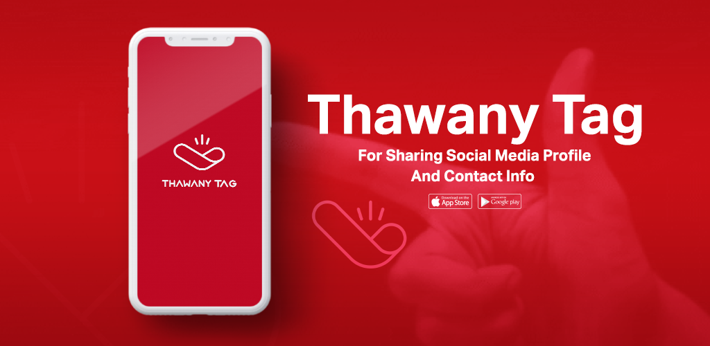
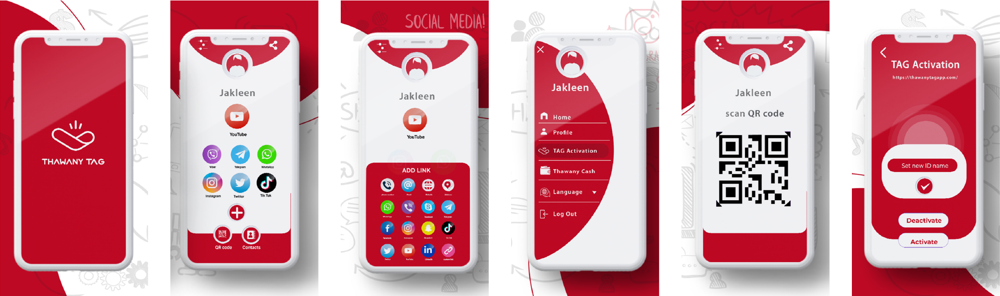
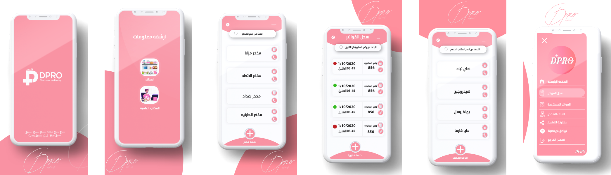
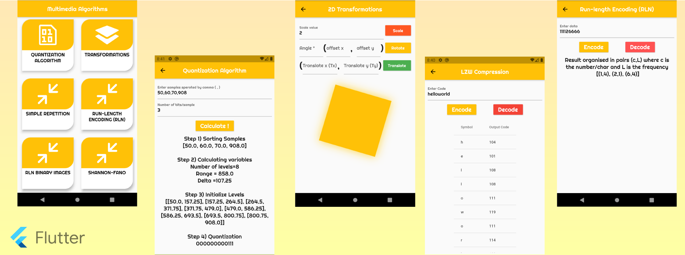
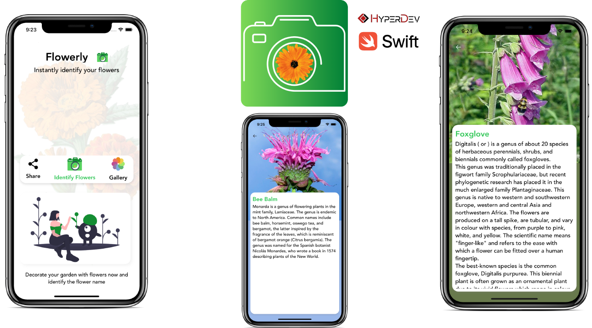
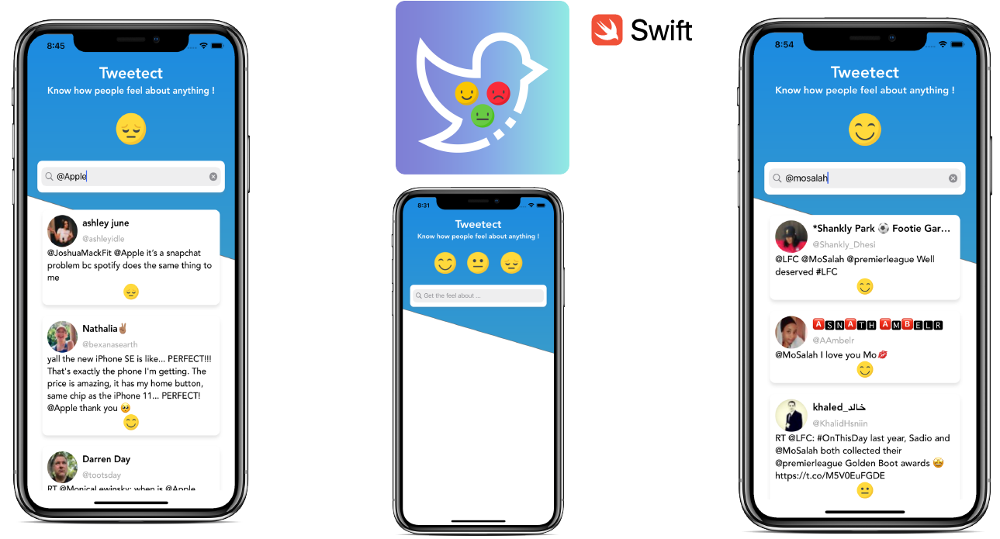

&nbsp;&nbsp;&nbsp;
&nbsp;&nbsp;&nbsp;
 

# Portfolio 📱

This is my portfolio for Mobile & Desktop Development experiences

-------

|Project  |  Developed Using| is Open Source|
|:---:|:---:|:---:|
|  <a href="#thawany-tag">Thawany Tag</a> |   |  𐄂
<a href="#jam3ty">Jam3ty</a> |    |  𐄂
<a href="#dpro-pharmacy-archiving">Dpro Pharmacy Archiving</a> |   |  𐄂
<a href="#educate-me-">Educate Me</a> |   |  𐄂
<a href="#nile-gift-">Nile Gift</a>  |  |  ✅
<a href="#multimedia-compression-algorithms-app-">Multimedia Algorithms App</a>  |  |  ✅
<a href="#coronaapp-">CoronaApp</a>  |   |  𐄂
<a href="#drively-">Drively</a> |  |  ✅
  <a href="#flowerly-">Flowerly</a> |  |  ✅
<a href="#tweetect-">Tweetect</a>  | |  ✅
<a href="#mcq-eye-">MCQ-EYE</a>  |  |  𐄂

-------
## Thawany TAG

 &nbsp;&nbsp;&nbsp;
    

 

[Thawany TAG ](https://play.google.com/store/apps/details?id=com.tou.thawany_tag) Is The Gadget Your Social Media Needs.
What’s even more amazing about Thawany TAG is that you can also connect any of your payment platforms and pay for anything on the go. With a single tap, you can easily transfer money to your friends or when you need to pay for groceries.

**Features**
 
- Keep all your accounts in one accessible place – You won’t need to keep notes on all your social media or your friend’s contact information. With Thawany TAG, it is not a hassle anymore.
- Meet new people with confidence – Ignore the awkward short talks and get straight to the point. Share your information and easily pair up with business partners with Thawany TAG by your side.
- Share your social media accounts and contact information easily – You won’t have to feel awkward when sharing your information anymore. Make your friends tap their phones to the Thawany TAG, and you’re done.
- Create your own bio and highlight your best features – Always keep your profiles up to date and easily accessible with it.
- Connect with new people effortlessly – You won’t have to make the dreading small talk. Easily get to the point and even use it as an ice-breaker and discussion topic.

<h4 align="left"> 🚀 Supported Platforms </h4>

&nbsp;&nbsp;&nbsp;&nbsp;&nbsp;&nbsp;
   

| 👨‍💻 Development Team| 🔧 Role |
| :---: |:---: |
| [Mohaned Yossry](https://github.com/Mohanedy98) | 📱 Flutter Developer    |
| [Mohamed Sedky](https://github.com/mohammmedsedky)| 📱 Flutter Developer |

## Jam3ty

 &nbsp;&nbsp;&nbsp;
    

 

[Jam3ty](https://apps.apple.com/us/app/jam3ty-%D8%AC%D8%A7%D9%85%D8%B9%D8%AA%D9%8A/id1536444786) is your easy way to understand and succeed, as the application provides a wide range of courses and explanations to various universities and colleges through a group of the most experienced university professors and lecturers. The application also provides services that will help you solve and understand your assignments to facilitate your educational life and to make the most of what you will learn!.

<h4 align="left"> 🚀 Supported Platforms </h4>

&nbsp;&nbsp;&nbsp;&nbsp;&nbsp;&nbsp;
   

| 👨‍💻 Development Team| 🔧 Role |
| :---: |:---: |
| [Mohaned Yossry](https://github.com/Mohanedy98) | 📱 Flutter Developer    |
| [Abanoub Shawky](https://github.com/Abanoub-Showky)| 📱 Flutter Developer |
| [Ahmed Farag](https://github.com/ahmedfarag1993)|☁️ Nodejs Developer |
| [Mohamed Mostafa](-)|🌍 Front End Web Developer |

Developed by  Team

## Dpro Pharmacy Archiving

 &nbsp;&nbsp;&nbsp;
    

 

[Dpro Pharmacy Archiving](https://apps.apple.com/us/app/dpro-pharmacy-archiving/id1559044527) is an iOS & Android app made using **Flutter** and **Dart**. To keep pace with the development in the field of automation, which is the medical field at its head, and to help pharmacists in managing their work easily and easily and to ensure complete comfort for them in preparing invoices, archiving and preserving information.

This application helps pharmacists to archive scientific office bills and releases information with just one click of a button.

Application features:

1- It works to archive data and bills of scientific offices and archives without the need for internet.

2- The speed of storing information while ensuring that the information is not lost in the event of losing the mobile phone.

3- Quick access to the billing record by searching the invoice number or date.

4- Ease of adding information and details of payment status and placing invoices.

5- The ability (archiving) to save a copy of the invoice and the payment receipt and refer to it at any time.

6- Ease of contacting the scientific and archiving office.

Other advantages :

1- Archiving invoices in detail and making them easy to access later (bills returned - invoices paid - invoices that have not been paid).

2- Saving data in digital form, which reduces the cost of paper and medical films, in addition to security and the ability to retrieve and save data.

3- The pharmacist can send and share the invoice file to any scientific office or storeroom when needed.

<h4 align="left"> 🚀 Supported Platforms </h4>

&nbsp;&nbsp;&nbsp;&nbsp;&nbsp;&nbsp;
   

| 👨‍💻 Development Team| 🔧 Role |
| :---: |:---: |
| [Mohaned Yossry](https://github.com/Mohanedy98) | 📱 Flutter Developer    |
| [Mohamed Sedky](https://github.com/mohammmedsedky)| 📱 Flutter Developer |

Developed by  Team

## Educate Me 📚

&nbsp;&nbsp;&nbsp;&nbsp;&nbsp;&nbsp;
    

 

[Educate Me](https://play.google.com/store/apps/details?id=com.hyperdev.educate_me) is an iOS & Android app made using **Flutter** and **Dart** that aims to connect  students, teachers, parents and school under the same platform and providing services that facilitate the educational process for each individual participant and to increase the efficiency of the evaluation system as well as administrative services that work to link Schools, educational directorates, and the Ministry under the same platform.

<h4 align="left"> 🚀 Supported Platforms </h4>

&nbsp;&nbsp;&nbsp;&nbsp;&nbsp;&nbsp;
   

| 🔨 Technologies Used|
| ------------- |
| Bloc Pattern |
| Cloud Firestore|
| Firebase Storage|
| Singleton Pattern|
| Push Notifications|
| Local Notifications|
| Nearby Services|
| Bluetooth|
| Location Services|
| Data Encryption|
| Charts|

| 👨‍💻 Development Team| 🔧 Role |
| :---: |:---: |
| [Mohaned Yossry](https://github.com/Mohanedy98) | 📱 Flutter Developer    |
| [Abanoub Shawky](https://github.com/Abanoub-Showky)| 📱 Flutter Developer |
| [Mahmoud Sharaf](https://github.com/MahmoudSharaf55)| 🌐 Web Developer |
| [Mohamed Sedky](https://github.com/mohammmedsedky)| 📱 Flutter Developer |
| Mostafa Khedr | 🌐 Web Developer |

Developed by  Team

## Nile Gift 📜

&nbsp;&nbsp;&nbsp;&nbsp;&nbsp;&nbsp;&nbsp;&nbsp;&nbsp;
    

 

[Nile Gift](https://play.google.com/store/apps/details?id=com.mohanedy98.gift_of_the_nile&hl=en) is an iOS & Android app made using **Flutter** and **Dart** Nile gift is a vertical timeline that allows you to navigate through ancient Egyptian characters (deity, pharaohs), learn more about them, their stories, images, and videos with fully animated and illustrated characters and also provide the ability to locate characters monuments and order uber to the monument directly.

<h4 align="left"> 🚀 Supported Platforms </h4>

&nbsp;&nbsp;&nbsp;
   

| 🔨 Technologies Used
| ------------- |
| Bloc Pattern |
| Animations|
| Location Services|
| Charts|

| 👨‍💻 Development Team| 🔧 Role |
| :---: |:---: |
| [Mohaned Yossry](https://github.com/Mohanedy98) | 📱 Flutter Developer    |
| [Shimaa Ghanima](https://github.com/ShimaaGhanima)| 📱 Flutter Developer |
| [Abdullah Rezk](https://github.com/AbdallhaRezk)| 📱 Flutter Developer |

## Multimedia Algorithms App 🎧

&nbsp;&nbsp;&nbsp &nbsp;&nbsp;&nbsp;
    

 

[Multimedia Algorithms App](https://github.com/Mohanedy98/multimedia-algorithms) is an iOS & Android app made using **Flutter** and **Dart** This app implement some basic multimedia compression algorithms (step by step) also some techniques used in multimedia like quantization using dart and flutter

<h4 align="left"> 🚀 Supported Platforms </h4>

&nbsp;&nbsp;&nbsp;
   

| 🔨 Technologies Used
| ------------- |
| Bloc Pattern |
| Animations|
| Charts|

| 👨‍💻 Development Team| 🔧 Role |
| :---: |:---: |
| [Mohaned Yossry](https://github.com/Mohanedy98) | 📱 Flutter Developer    |

## CoronaApp 😷

&nbsp;&nbsp;&nbsp;
    

 

CoronaApp is an iOS & Android app made using **Flutter** and **Dart**. CoronaApp is An application that limits the spread of the Coronavirus by tracing all contacts within 3 meters distance. provides notifications for infected areas also provides news and interactive map for CoronaVirus spread.

<h4 align="left"> 🚀 Supported Platforms </h4>

&nbsp;&nbsp;&nbsp;
   

| 🔨 Technologies Used
| ------------- |
| Bloc Pattern |
| Cloud Firestore|
| Firebase Storage|
| Background tasks using [Background Fetch Package](https://pub.dev/packages/background_fetch)|
| Animations|
| Location Services|
| Google Maps|
| Local Notifications|
| Push Notifications|
| Multi-Language support |
| Networking |
| Nearby Services|
| Bluetooth|
| Data Encryption|
| Charts|

| 👨‍💻 Development Team| 🔧 Role |
| :---: |:---: |
| [Mohaned Yossry](https://github.com/Mohanedy98) | 📱 Flutter Developer    |
| [Abanoub Shawky](https://github.com/Abanoub-Showky)| 📱 Flutter Developer |

Developed by  Team

## Drively 🚗

&nbsp;&nbsp;&nbsp;
 &nbsp;&nbsp;&nbsp;
    

 

Drively is an iOS app made using **Swift 5** . uses Firebase and MapKit to provide Riding Services (like Uber).

<h4 align="left"> 🚀 Supported Platforms </h4>

&nbsp;&nbsp;&nbsp;
   

| 🔨 Technologies Used
| ------------- |
| Delegate Design Pattern  |
| MVC Design Pattern |
| MapKit |
| Firebase (Firestore, Authentication)|
| Location Tracking|

| 👨‍💻 Development Team| 🔧 Role |
| :---: |:---: |
| [Mohaned Yossry](https://github.com/Mohanedy98) | 📱 iOS Developer    |

## Flowerly 🌸

&nbsp;&nbsp;&nbsp;
 &nbsp;&nbsp;&nbsp;
    

 

Flowerly is an iOS app made using **Swift 5** . uses CoreML to predict flower name and information.

<h4 align="left"> 🚀 Supported Platforms </h4>

&nbsp;&nbsp;&nbsp;
   

| 🔨 Technologies Used
| ------------- |
| Delegate Design Pattern  |
| CoreML Framework |
| Alamofire to get flower information from [Wikipedia Api](https://www.mediawiki.org/wiki/API:Main_page)|
| [Chameleon Framework](https://github.com/viccalexander/Chameleon)|
| [SwiftyJSON](https://github.com/SwiftyJSON/SwiftyJSON) to parse the json response from the API|

| 👨‍💻 Development Team| 🔧 Role |
| :---: |:---: |
| [Mohaned Yossry](https://github.com/Mohanedy98) | 📱 iOS Developer    |

## Tweetect 😄😐😡

&nbsp;&nbsp;&nbsp;
 &nbsp;&nbsp;&nbsp;
    

 

Tweetect is an iOS app made using **Swift 5** .the app uses CoreML and Twitter API to perform sentiment analysis on tweets.

<h4 align="left"> 🚀 Supported Platforms </h4>

&nbsp;&nbsp;&nbsp;
   

| 🔨 Technologies Used
| ------------- |
| Delegate Design Pattern  |
| CoreML Framework |
| Swifter framework to get tweets from [Twitter API](https://github.com/mattdonnelly/Swifter)|
| [SDWebImage](https://github.com/SDWebImage/SDWebImage)|

| 👨‍💻 Development Team| 🔧 Role |
| :---: |:---: |
| [Mohaned Yossry](https://github.com/Mohanedy98) | 📱 iOS Developer    |

## MCQ-EYE 👁️

&nbsp;&nbsp;&nbsp;
    

 

[MCQ-EYE](https://mcqeye.github.io/) is a Desktop app made using **JAVA** & **JavaFX**.
* MCQ-EYE is The Solution for Multiple-Choice Questions Grading and Analysis.
* Can grade and analyze papers in just a seconds.
* High Performance and Accurate results.
* Generate reports in just second with different formats.
* Secure with session tracking and data encryption.
* Dynamic Questions paper up to 100 Question per paper.

<h4 align="left"> 🚀 Supported Platforms </h4>

&nbsp;&nbsp;&nbsp;&nbsp;&nbsp;&nbsp; &nbsp;&nbsp;&nbsp;&nbsp;
   

| 🔨 Technologies Used
| ------------- |
| MVC Pattern  |
| OpenCV Framework for JAVA |
| SQLite Database |
| Image Processing Algorithms |
| Multithreading and parallel processing techniques |
| [JFoenix Library](https://github.com/jfoenixadmin/JFoenix)|

| 👨‍💻 Development Team| 🔧 Role |
| :---: |:---: |
| [Mohaned Yossry](https://github.com/Mohanedy98) | 🖥️ Java Developer    |
| [Abanoub Shawky](https://github.com/Abanoub-Showky)| 🖥️ Java Developer |
| [Mahmoud Sharaf](https://github.com/MahmoudSharaf55)| 🖥️ Java Developer |

[swift-icon]: http://example.com/whatever
