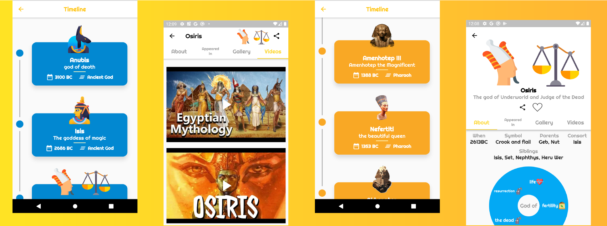
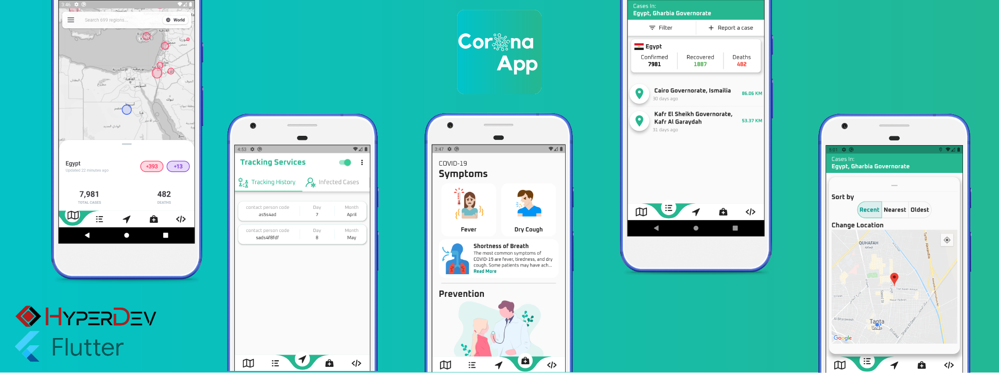
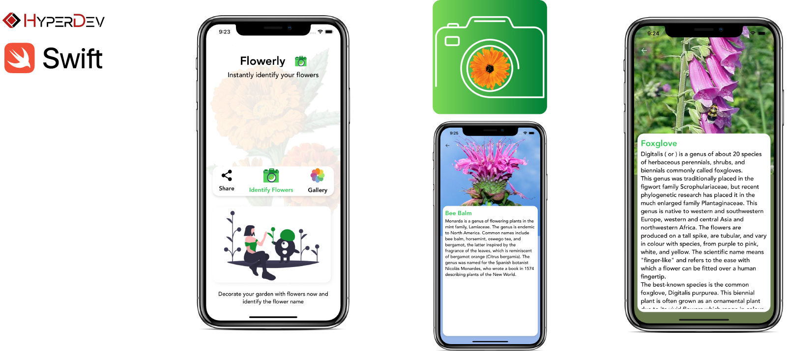

&nbsp;&nbsp;&nbsp;
&nbsp;&nbsp;&nbsp;
 

# Portfolio 📱

This is my portfolio for Mobile Development experiences with both iOS (Swift) & Flutter (Dart)

-------

    <a href="#educate-me-">Educate Me 📚</a> &bull;
    <a href="#nile-gift-">Nile Gift 📜</a> &bull;
    <a href="#coronaapp-">CoronaApp 😷</a> &bull;
    <a href="#flowerly-">Flowerly 🌸</a> &bull;
    <a href="#tweetect-">Tweetect 😄😐😡</a>
    
  

-------
## Educate Me 📚

&nbsp;&nbsp;&nbsp;&nbsp;&nbsp;&nbsp;
    

 

[Educate Me](https://play.google.com/store/apps/details?id=com.hyperdev.educate_me) is an iOS & Android app made using **Flutter** and **Dart** that aims to connect  students, teachers, parents and school under the same platform and providing services that facilitate the educational process for each individual participant and to increase the efficiency of the evaluation system as well as administrative services that work to link Schools, educational directorates, and the Ministry under the same platform.

<h4 align="left"> 🚀 Supported Platforms </h4>

&nbsp;&nbsp;&nbsp;&nbsp;&nbsp;&nbsp;
   

| 🔨 Technologies Used|
| ------------- |
| Bloc Pattern |
| Cloud Firestore|
| Firebase Storage|
| Singleton Pattern|
| Push Notifications|
| Local Notifications|
| Nearby Services|
| Bluetooth|
| Location Services|
| Data Encryption|
| Charts|

| 👨‍💻 Development Team| 🔧 Role |
| :---: |:---: |
| [Mohaned Yossry](https://github.com/Mohanedy98) | 📱 Flutter Developer    |
| [Abanoub Shawky](https://github.com/Abanoub-Showky)| 📱 Flutter Developer |
| [Mahmoud Sharaf](https://github.com/MahmoudSharaf55)| 🌐 Web Developer |
| [Mohamed Sedky](https://github.com/mohammmedsedky)| 📱 Flutter Developer |
| Mostafa Khedr | 🌐 Web Developer |

Developed by  Team

## Nile Gift 📜

&nbsp;&nbsp;&nbsp;&nbsp;&nbsp;&nbsp;&nbsp;&nbsp;&nbsp;
    

 

[Nile Gift](https://play.google.com/store/apps/details?id=com.mohanedy98.gift_of_the_nile&hl=en) is an iOS & Android app made using **Flutter** and **Dart** Nile gift is a vertical timeline that allows you to navigate through ancient Egyptian characters (deity, pharaohs), learn more about them, their stories, images, and videos with fully animated and illustrated characters and also provide the ability to locate characters monuments and order uber to the monument directly.

<h4 align="left"> 🚀 Supported Platforms </h4>

&nbsp;&nbsp;&nbsp;
   

| 🔨 Technologies Used
| ------------- |
| Bloc Pattern | 
| Animations|
| Location Services|
| Charts|

| 👨‍💻 Development Team| 🔧 Role |
| :---: |:---: |
| [Mohaned Yossry](https://github.com/Mohanedy98) | 📱 Flutter Developer    |
| [Shimaa Ghanima](https://github.com/ShimaaGhanima)| 📱 Flutter Developer |
| [Abdullah Rezk](https://github.com/AbdallhaRezk)| 📱 Flutter Developer |

## CoronaApp 😷

&nbsp;&nbsp;&nbsp;
    

 

CoronaApp is an iOS & Android app made using **Flutter** and **Dart**. CoronaApp is An application that limits the spread of the Coronavirus by tracing all contacts within 3 meters distance. provides notifications for infected areas also provides news and interactive map for CoronaVirus spread.

<h4 align="left"> 🚀 Supported Platforms </h4>

&nbsp;&nbsp;&nbsp;
   

| 🔨 Technologies Used
| ------------- |
| Bloc Pattern | 
| Cloud Firestore|
| Firebase Storage|
| Background tasks using [Background Fetch Package](https://pub.dev/packages/background_fetch)|
| Animations|
| Location Services|
| Google Maps|
| Local Notifications|
| Push Notifications|
| Multi-Language support |
| Networking |
| Nearby Services|
| Bluetooth|
| Data Encryption|
| Charts|

| 👨‍💻 Development Team| 🔧 Role |
| :---: |:---: |
| [Mohaned Yossry](https://github.com/Mohanedy98) | 📱 Flutter Developer    |
| [Abanoub Shawky](https://github.com/Abanoub-Showky)| 📱 Flutter Developer |

Developed by  Team

## Flowerly 🌸

&nbsp;&nbsp;&nbsp;
 &nbsp;&nbsp;&nbsp;
    

 

Flowerly is an iOS app made using **Swift 5** . uses CoreML to predict flower name and information.

<h4 align="left"> 🚀 Supported Platforms </h4>

&nbsp;&nbsp;&nbsp;
   

| 🔨 Technologies Used
| ------------- |
| Delegate Design Pattern  |
| CoreML Framework | 
| Alamofire to get flower information from [Wikipedia Api](https://www.mediawiki.org/wiki/API:Main_page)|
| [Chameleon Framework](https://github.com/viccalexander/Chameleon)|
| [SwiftyJSON](https://github.com/SwiftyJSON/SwiftyJSON) to parse the json response from the API|

| 👨‍💻 Development Team| 🔧 Role |
| :---: |:---: |
| [Mohaned Yossry](https://github.com/Mohanedy98) | 📱 iOS Developer    |

## Tweetect 😄😐😡

&nbsp;&nbsp;&nbsp;
 &nbsp;&nbsp;&nbsp;
    

 

Tweetect is an iOS app made using **Swift 5** .the app uses CoreML and Twitter API to perform sentiment analysis on tweets.

<h4 align="left"> 🚀 Supported Platforms </h4>

&nbsp;&nbsp;&nbsp;
   

| 🔨 Technologies Used
| ------------- |
| Delegate Design Pattern  |
| CoreML Framework | 
| Swifter framework to get tweets from [Twitter API](https://github.com/mattdonnelly/Swifter)|
| [SDWebImage](https://github.com/SDWebImage/SDWebImage)|

| 👨‍💻 Development Team| 🔧 Role |
| :---: |:---: |
| [Mohaned Yossry](https://github.com/Mohanedy98) | 📱 iOS Developer    |
