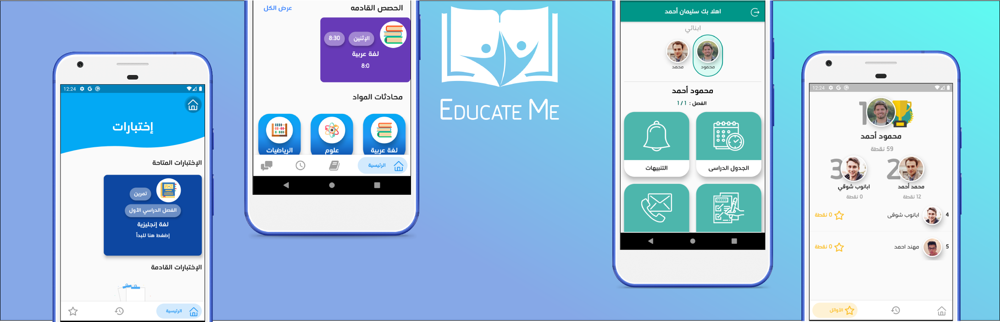

&nbsp;&nbsp;&nbsp;
&nbsp;&nbsp;&nbsp;
 

# Portfolio 📱

This is my portfolio for Mobile Development experiences with both iOS (Swift) & Flutter (Dart)

-------

    <a href="#educate-me-">Educate Me 📚</a> &bull;
    <a href="#nile-gift">Nile Gift 📜</a> &bull;
  

-------
## Educate Me 📚
&nbsp;&nbsp;&nbsp;&nbsp;&nbsp;&nbsp;
 
[Educate Me](https://play.google.com/store/apps/details?id=com.hyperdev.educate_me) is an iOS & Android app made using **Flutter** and **Dart** that aims to connect  students, teachers, parents and school under the same platform and providing services that facilitate the educational process for each individual participant and to increase the efficiency of the evaluation system as well as administrative services that work to link Schools, educational directorates, and the Ministry under the same platform.

| 🔨 Technologies Used| 🚀 Platform Supported|
| ------------- | :---: |
| Bloc Pattern | 📱 iOS     |
| Cloud Firestore|📱 Android      |
| Firebase Storage|🌐 Web |
| Singleton Pattern|
| Push Notifications|
| Local Notifications|
| Nearby Services|
| Bluetooth|
| Location Services|
| Data Encryption|
| Charts|

## Nile Gift 📜
&nbsp;&nbsp;&nbsp;&nbsp;&nbsp;&nbsp;
 
[Nile Gift](https://play.google.com/store/apps/details?id=com.mohanedy98.gift_of_the_nile&hl=en) is an iOS & Android app made using **Flutter** and **Dart** Nile gift is a vertical timeline that allows you to navigate through ancient Egyptian characters (deity, pharaohs), learn more about them, their stories, images, and videos with fully animated and illustrated characters and also provide the ability to locate characters monuments and order uber to the monument directly.

| 🔨 Technologies Used|🚀 Platform Supported|
| ------------- |:---: |
| Bloc Pattern | 📱 iOS     |
| Animations|📱 Android      |
| Location Services|
| Charts|

